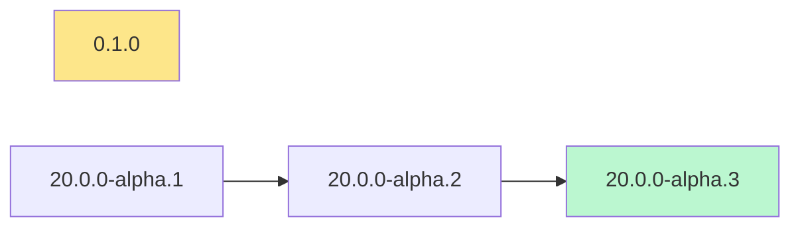

# Operator Upgrade Path

`operator_upgrade_path.py` shows the OLM upgrade graph of an operator channel, and the upgrade path OLM follows from an installed version to the channel head.

Use it to answer questions like:

- "We run cluster-logging 6.4.2: how many upgrades to reach the latest 6.4.z, and through which versions?"
- "If we switch the Subscription to `stable-6.6`, can OLM upgrade directly from our version?"
- "Why is the operator stuck on an old version?"

## Features

✅ **Upgrade path** - Every step OLM takes from an installed version to the channel head, and why (`replaces`, `skips`, `skipRange`)  
✅ **Channel graph** - Every version of a channel, its edges, and which versions can upgrade to it directly  
✅ **Channel switch** - Path from a version installed in one channel to the head of another  
✅ **Exact data** - Read from the operator index image itself, the same catalog OLM uses  
✅ **Diagram** - Mermaid output, with the path highlighted, renders in GitHub/GitLab markdown  
✅ **Disconnected clusters** - Works on a mirrored index image, or on an already extracted catalog  
✅ **Multiple Output Formats** - Table, Mermaid and JSON  

## Requirements

- Python 3.9+ (standard library only)
- The `oc` CLI, to extract the catalog from the index image
- Access to `registry.redhat.io` (Red Hat login or pull secret)
- For YAML catalogs only: PyYAML or `yq` (Red Hat index images use JSON)

```bash
chmod +x operator_upgrade_path.py

# Log in to the Red Hat registry (Customer Portal credentials)
podman login registry.redhat.io
```

If `oc` doesn't pick up the login, give the auth file or a pull secret explicitly:

```bash
./operator_upgrade_path.py 4.21 cluster-logging --registry-config ~/.config/containers/auth.json
./operator_upgrade_path.py 4.21 cluster-logging --registry-config ~/pull-secret.json
```

## Usage

```bash
./operator_upgrade_path.py <ocp_version> <package> [options]
```

| Option | Description |
|---|---|
| `ocp_version` | OpenShift version, e.g. `4.21`. Selects the index image tag (`:v4.21`); a full release like `4.21.17` gives the same result |
| `package` | Operator package name, e.g. `cluster-logging`. Find names with `list_operators.py` |
| `-C, --channel` | Channel to use (default: the package's default channel) |
| `--from VERSION` | Installed version (`6.4.2`, `v6.4.2` or the CSV name `cluster-logging.v6.4.2`): shows the upgrade path to the head |
| `-c, --catalog` | `redhat-operators` (default), `certified-operators`, `community-operators` or `redhat-marketplace` |
| `--index IMAGE` | Index image to use instead of the catalog, e.g. a mirrored index |
| `--catalog-dir DIR` | Read an already extracted `/configs/<package>/` directory instead of the image |
| `-a, --registry-config FILE` | Registry auth file (pull secret) passed to `oc image extract` |
| `-f, --format` | `table` (default), `mermaid` or `json` |

Without `--from`, the script shows the channel graph. With `--from`, it shows the upgrade path.

### Examples

```bash
# Graph of the default channel
./operator_upgrade_path.py 4.21 cluster-logging

# Graph of another channel
./operator_upgrade_path.py 4.21 cluster-logging -C stable-6.5

# Upgrade path from the installed version to the head of the default channel
./operator_upgrade_path.py 4.21 cluster-logging --from 6.4.2

# Upgrade path after switching the Subscription to another channel
./operator_upgrade_path.py 4.21 cluster-logging --from 6.4.2 -C stable-6.6

# Diagram for a markdown page
./operator_upgrade_path.py 4.21 cluster-logging --from 6.4.2 -f mermaid > cluster-logging-path.md

# Operator from the certified catalog
./operator_upgrade_path.py 4.21 <package> -c certified-operators

# Disconnected cluster: use the mirrored index
./operator_upgrade_path.py 4.21 cluster-logging --from 6.4.2 \
    --index registry.example.com/mirror/redhat/redhat-operator-index:v4.21
```

### Finding the installed version on a cluster

```bash
# Installed CSV and channel of a Subscription
oc get subscription -n openshift-logging cluster-logging \
  -o jsonpath='{.status.installedCSV}{"  "}{.spec.channel}{"\n"}'
# cluster-logging.v6.4.2  stable-6.4

./operator_upgrade_path.py 4.21 cluster-logging --from cluster-logging.v6.4.2 -C stable-6.4
```

## Output

The examples below come from the public OperatorHub.io catalog (`quay.io/operatorhubio/catalog`), which uses the same format as the Red Hat index images.

### Upgrade path (`--from`)

```
Upgrade path for community-kubevirt-hyperconverged in channel stable
Catalog: quay.io/operatorhubio/catalog:latest
==========================================================================================
  Installed      1.4.0  (kubevirt-hyperconverged-operator.v1.4.0)
  Channel head   1.18.1  (kubevirt-hyperconverged-operator.v1.18.1)
------------------------------------------------------------------------------------------
    1. 1.4.0                -> 1.10.1               (skipRange >=1.0.0 <1.10.1)
    2. 1.10.1               -> 1.11.1               (replaces)
    3. 1.11.1               -> 1.12.0               (replaces)
   ...
   13. 1.18.0               -> 1.18.1               (replaces)
------------------------------------------------------------------------------------------
  13 upgrade(s) to reach the head: 1.4.0 -> 1.10.1 -> 1.11.1 -> ... -> 1.18.1
```

Each step shows the edge OLM uses. Other possible results:

| Message | Meaning |
|---|---|
| `Already at the channel head, nothing to upgrade.` | The installed version is the latest one of the channel |
| `X is newer than the channel head` | The installed version is ahead of this channel (e.g. it came from a faster channel) |
| `No upgrade edge from X in channel Y` | No entry of the channel can replace the installed version: OLM can't upgrade it in this channel |
| `Stuck at X` | The path starts but stops before the head: an entry is missing an edge |

### Channel graph (default)

```
Upgrade graph for keycloak-operator - channel alpha
Catalog: quay.io/operatorhubio/catalog:latest
Channels: alpha, candidate, fast *
==============================================================================================================
  Version               Replaces              Skips                 skipRange                   Direct upgrade from
--------------------------------------------------------------------------------------------------------------
  19.0.3  (head)        19.0.2                -                     -                           19.0.2
  ...
  13.0.1                12.0.3                13.0.0                -                           12.0.3, 13.0.0
  ...
  9.0.2                 8.0.2                 9.0.0                 -                           8.0.2, 9.0.0
--------------------------------------------------------------------------------------------------------------
  28 entries, head 19.0.3
```

| Column | Meaning |
|---|---|
| `Version` | Channel entry, head first, then down the `replaces` chain |
| `Replaces` | The version this entry upgrades from in the normal chain |
| `Skips` | Versions this entry upgrades from directly (they are skipped on the way) |
| `skipRange` | Every version in this semver range can upgrade directly to this entry |
| `Direct upgrade from` | All known versions that can upgrade to this entry in one step (summarized when more than 6) |

`*` in the channel list marks the default channel.

### Mermaid diagram (`-f mermaid`)

Outputs a fenced ` ```mermaid ` block, rendered as a diagram by GitHub, GitLab and the VS Code markdown preview:

- solid arrow: `replaces`
- dotted arrow: `skips`, and `skipRange` (shown as a separate label node)
- red thick arrows: the upgrade path (with `--from`)
- yellow node: installed version, green node: channel head



Channels with a long history produce large diagrams. Use the table or JSON for those.

### JSON (`-f json`)

```json
{
  "package": "keycloak-operator",
  "catalog": "quay.io/operatorhubio/catalog:latest",
  "channel": "alpha",
  "default_channel": "fast",
  "channels": ["alpha", "candidate", "fast"],
  "head": "19.0.3",
  "entries": [
    {"version": "19.0.3", "name": "keycloak-operator.v19.0.3", "replaces": "keycloak-operator.v19.0.2",
     "skips": [], "skipRange": null, "upgrade_from": ["19.0.2"]}
  ],
  "path": {
    "from": "18.0.0",
    "reaches_head": true,
    "steps": [{"to": "18.0.1", "reason": "replaces"}, {"to": "18.0.2", "reason": "replaces"}]
  }
}
```

`path` is only present with `--from`.

```bash
# Number of upgrades to reach the head
./operator_upgrade_path.py 4.21 cluster-logging --from 6.4.2 -f json | jq '.path.steps | length'
```

## How it works

### Where the data comes from

1. The index image is chosen from the catalog and the OpenShift version:

   | Catalog | Index image |
   |---|---|
   | `redhat-operators` | `registry.redhat.io/redhat/redhat-operator-index:v4.21` |
   | `certified-operators` | `registry.redhat.io/redhat/certified-operator-index:v4.21` |
   | `community-operators` | `registry.redhat.io/redhat/community-operator-index:v4.21` |
   | `redhat-marketplace` | `registry.redhat.io/redhat/redhat-marketplace-index:v4.21` |

2. Only the package's directory is extracted, without pulling the whole image:
   ```bash
   oc image extract <index> --path /configs/<package>/:<tmpdir> --filter-by-os linux/amd64
   ```
3. The file-based catalog (FBC) is parsed: `olm.package` (default channel), `olm.channel` (entries with `replaces`, `skips`, `skipRange`) and `olm.bundle` (versions).

The Red Hat Ecosystem Catalog API used by `list_operators.py` is not used here: it doesn't expose `replaces` and `skips`, so the graph would be wrong.

### OLM upgrade rules

A channel entry can replace the installed bundle when:

- it `replaces` it, or
- it lists it in `skips`, or
- the installed version is in its `skipRange` (semver range, e.g. `>=6.2.0-0 <6.4.7`).

When several entries qualify, OLM picks the one **closest to the channel head**. The script repeats this from the installed version until it reaches the head.

Most Red Hat operators set a `skipRange` covering earlier versions on each release, so the path is often a single step to the head. Community operators often chain releases with `replaces` only, which means one upgrade per release.

### Channel switch

With `--from` and `-C`, the path is computed with the edges of the target channel. This is what OLM does when you change `spec.channel` on a Subscription: if no entry of the new channel replaces, skips or covers the installed version, OLM can't upgrade.

### Versions no longer in the catalog

If the installed version was pruned from the index, the script prints a warning and matches it by name (`<package>.v<version>`) and version, as OLM does for `skips` and `skipRange`.

## Limitations

- The catalog reflects the index image at the time of the query: new releases change the head and the path.
- The path follows OLM v0 (Subscription-based) rules. It doesn't account for manual approval (`installPlanApproval: Manual`): each step then waits for approval.
- Operators that declare a maximum OpenShift version (`olm.maxOpenShiftVersion`) may block a cluster upgrade. This script doesn't check it.
- When the installed bundle name doesn't follow `<package>.v<version>` and the version was pruned, pass the full CSV name to `--from`.

## Exit codes

| Code | Meaning |
|---|---|
| `0` | Success (including "no upgrade edge" or "already at the head") |
| `1` | Package has no channel, or the channel doesn't exist (the available channels are listed) |
| `2` | The catalog could not be extracted (authentication, network, package not in the index) |

## Related scripts

- `list_operators.py` - Operators available for an OpenShift version, with the latest version of each channel ([OPERATORS_README.md](OPERATORS_README.md))
- `list_versions.py` - OpenShift releases available per stream and update channel, with release dates
- `get_vulnerabilities.py` - CVEs affecting an OpenShift version, and the release that fixes them
